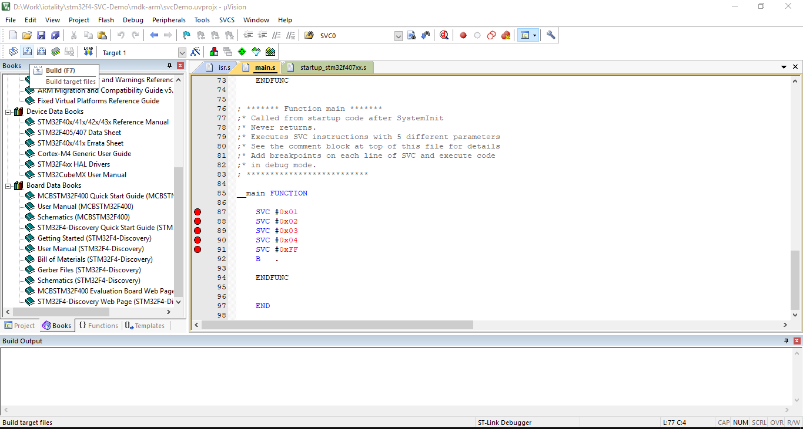

### Demonstration of SVC mechanism in ARM Cortex-M 

This repository contains code written in ARM (V7-M) assembly to demonstrate working of the SVC exception using the STM32F4-Discovery board.

For detailed explanation of the code, refer blog post - [https://iotality.com/armcm-svc](https://iotality.com/armcm-svc)

This code uses ARM assembler and not the GNU assembler with the Keil uVision IDE. Source code is contained in this repository in the [src](/src) folder. The project files (for Keil uVision IDE) are in the [mdk-arm](/mdk-arm) folder.

This README contains instructions to build and download the code to STM32F4 discovery board.

#### Prerequisites

* Get hold of a [STM32F4 Discovery board](www.st.com/en/evaluation-tools/stm32f4discovery.html)  so you can see the LEDs blinking. In absence of the board you can also use the Keil simulator and watch the registers but that part is not covered here.

* Download and install Keil MDK Lite Edition from Keil website - [keil.com/demo/eval/arm.htm#DOWNLOAD](keil.com/demo/eval/arm.htm#DOWNLOAD)

* Install software packs from Keil
 After installation of the IDE, you need to install the software packs for ST Micro devices.

 * Head to [http://www.keil.com/dd2/Pack/](http://www.keil.com/dd2/Pack/) and locate the ST Microelectronics STM32F4 Series Device Support Drivers and Examples. Click on the 'Download' button which will download an installation file with the extension '.pack'.

 

  * Double click on the downloaded file and follow on screen instructions to install the STM32F4 software pack within Keil.

#### Steps

Clone this repository and then follow the steps below to open the project and see yourself how the SVC (SuperVisor Call) works.

If you already have Keil MDK-ARM and STM32F4 software pack  installed then you can skip directly to step 3.

##### Step 1

Launch Keil uVision IDE. From the 'Project' menu click on 'Open Project' and select the project file  [mdk-arm/stm32f4-discovery-blink.uvprojx](mdk-arm/stm32f4-discovery-blink.uvprojx)

##### Step 2

The 'Books' tab shows useful documents and resources. In particular the STM32F40x Reference manual, STM32F407 Datasheet, STM32F4-Discovery user manual and ARM Cortex-M4 generic user guide come handy to understand and write assembly code.

##### Step 3

Connect the STM32F4 Discovery board to your PC. Make sure you connect the USB cable to the ST-Link debugger (circled in the below image).

##### Step 4

Build the project. From the 'Project' menu click on 'Build' or use hotkey 'F7' or click on the Build button in toolbar as shown below.

You should see the build messages with no errors in the 'Build Output' window. For now you can ignore the warning appearing about padding.

##### Step 5
Download code to the board. From the 'Flash' menu click on 'Download' button or use hotkey 'F8' or click on the Download button in the toolbar as shown below.

You should see messages with no errors in the Build Output window again.

At this moment, you should see all the four LEDs on the STM32F4 Discovery board light up. The code starts executing after flashing and the last SVC instruction causes the default service handler to be executed switching on all the LEDs. 

Now let's execute the code step by step and see each SVC instruction getting executed.

##### Step 6

Start the debug session by clicking on the menu 'Debug -> Start/Stop Debug Session' (Shortcut key: Control+F5) as shown below.

You may see a warning - "_EVALUATION MODE - Running with Code Size Limit: 32K warning_" if you are using MDK Lite.

Putting the code in debug also modifies the toolbar and now you can see the debug menu icons such as Run, Step Into, Step Over etc. in the menu.

##### Step 7

The debugger will halt the code at the first instruction from the startup file. This instruction calls the function SystemInit and then followed by a call to our main function.

Click on the 'Run' button in the debug toolbar (Shortcut key: F5) or from the menu 'Debug -> Run'

Since the project has already set breakpoints at the four SVC instructions in our main function, the code will now halt at the first SVC instruction. At this point, all LEDs on the board will be off due to the default state of GPIO port D pins.

##### Step 8

Now run the code again (F5), and the code will execute the first SVC instruction (passing the number 0x01). The SVC handler calls service function to switch on the first LED. The code will now halt at the next breakpoint which is the next SVC instruction passing number 0x02 to the handler.

Similarly, executing next SVC instruction (with number 0x02) will cause the handler to call second service function switching on the second LED.

You can repeat running the code and see that successive SVC instructions execute the respective SVC handlers to switch on corresponding LED.

Instead of Run, you can also Step Over the code by clicking on the '_Step Over_' button in Debug toolbar (Shortcut key: F10) or from menu 'Debug -> Step Over'.

If you would like to step through the SVC handler execution then '_Step_' into the code by clicking on the 'Step' button in Debug toolbar (Shortcut key: F11) or from menu 'Debug -> Step'.

When the last SVC instruction has executed, all LEDs will switch on. The last SVC number is 0xFF which causes a default service function to be called which switches on all the LEDs.

Finally, the code sits in an infinite loop with the <code>B .</code>  instruction. 

At this stage if you want to step through the code again, you will have to reset the program. To do so, click on '_RST_' button in the Debug toolbar or from menu 'Debug -> Reset CPU' and then repeat the debug steps.

##### Step 9

You are done. You have just seen how the SVC instruction works in ARM Cortex-M. For more details, head on to the blog post [https://iotality.com/armcm-svc](https://iotality.com/armcm-svc).
